##TODO
  - DATA:
   - HD:
    - verify and validate audiobookshelf
    - verify and validate komga
    - verify and validate jellyfin
  - Immich:
   - figure out how to best implement current photos integration.
  Services:
   - Combine glances with influx db & Grafana
  Codebase:
   - fix off switch  (root?)
   - implement .evnv for creds ondocker compose.
  - Airgap:
   - implement NTFY
  - General:
   - improve/centralise/document ALL logging.

# Versions
### OS:
- Raspberry Pi OS Lite
- Release date: July 4th 2024
- System: 64-bit
- Kernel version: 6.6
- Debian version: 12 (bookworm)
### Nextcloud
- FE - nextcloud:29.0.2
- BE - mariadb:11.4.2
### Jellyfin
- jellyfin:latest
### Glances
- docker.io/nicolargo/glances
### Komga
- gotson/komga:latest
### Immich
 - v1.118.2
 - immich-server:v1.103.1
### Audiobookshelf
- 2.15.0

### Config control node
Clone this repo
`git clone https://github.com/scottolivermorgan/NAS_drive.git && cd NAS_drive`

You need to install Ansible. For that use:
`pip install -r requirements.txt`

`ansible-galaxy collection install -r requirements.yml --force`

Get host IP
`sudo apt install net-tools`
`ifconfig`

edit inventory.yml host and name

edit main.yml git name and email

### Testing
## Ansibledocker build .
cd to test dir
`cd tests/ansible`

~~`ssh-keygen -t rsa`~~

first time, build docker file
docker build -t t .
~~`docker build .`~~
`docker-compose up`

## First debug the connection:
ensure .shh/.... empty first 
`ansible-playbook -i inventory.yml debug.yml`

If everything works, run the full suite:

`ansible-playbook -i inventory.yml main.yml -vv`

# serices
jellyfin
http://192.168.1.9:8096

komga
http://192.168.1.9:25600

nextcloud
http://192.168.1.9:8000

glances
http://192.168.1.9:61208

audiobookshelf
http://192.168.1.9:13378

Immich
http://192.168.1.9:2283

# Pre steps
- Rename main external hard drive to HD_1 and back up to BU_1, follow ths convention
for all subsequent drives and add these details (alongsde the signal pin) to config.json.
Make a dir to store Plex metadata on HD_1 i.e. HD_1/Media/metadata.

- _note_ Synch drives before setting up as MUCH quciker if large and popultated (use Free file sync).

- Ensure HD_1 is attatched to permenant usb and BU_1 attatched to realy controlled USB.

## Initial Pi 4 Setup
Download SD card formating software:
https://www.sdcard.org/downloads/formatter/

Format card on local machine:

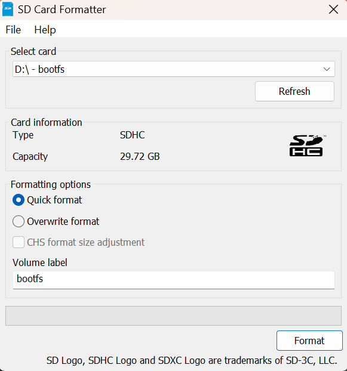

Download Raspberry Pi Imager:
https://www.raspberrypi.com/software/

Run Raspberry Pi Imager and flash OS,
version: 
``Raspberian Lite 64bit``

Select settings (cog wheel - lower right)

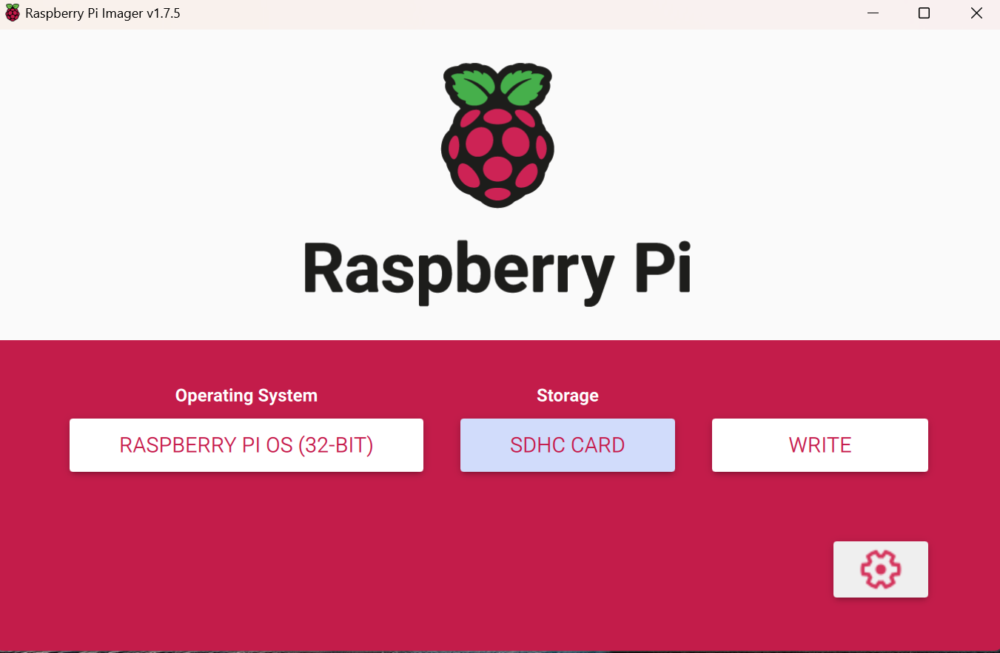

Select 'Enable shh'
Select 'Use password authentication'
'set authorised keys' auto fills to local user.
enter username and password. __DO NOT USE DEFAULT USERNAME & PASSWORDS__.

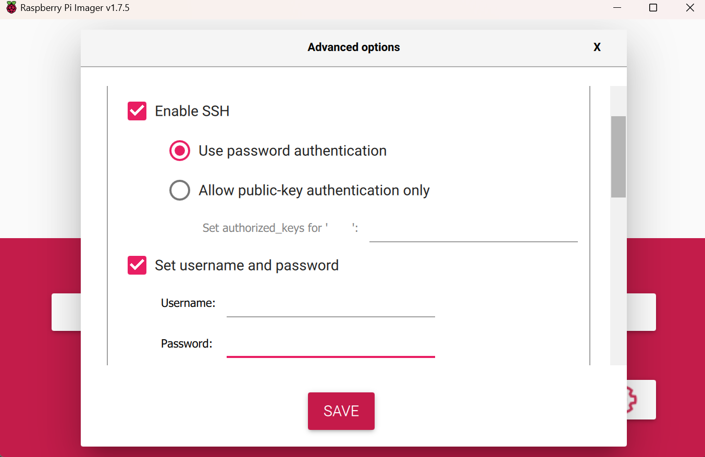

Select 'Configure wireless LAN option and enter network details.
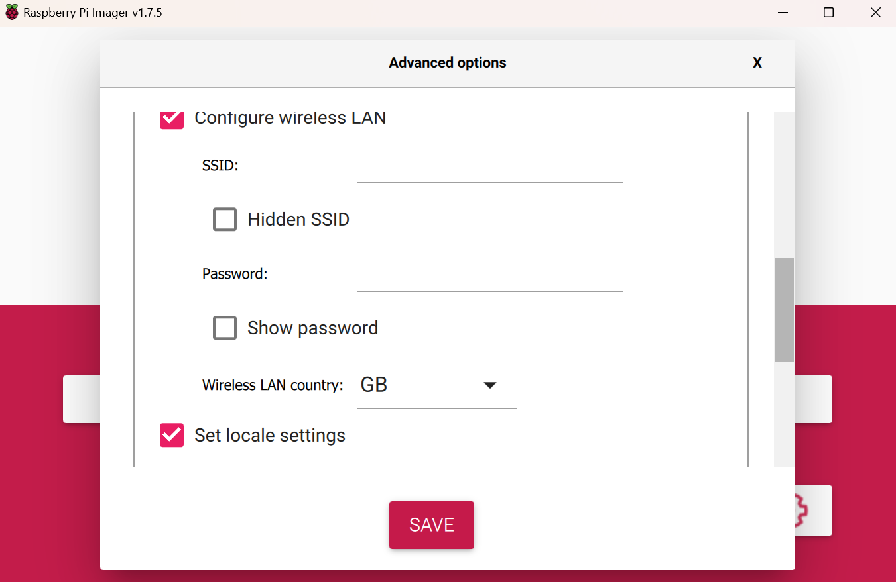

Local settings auto filled, if not complete.
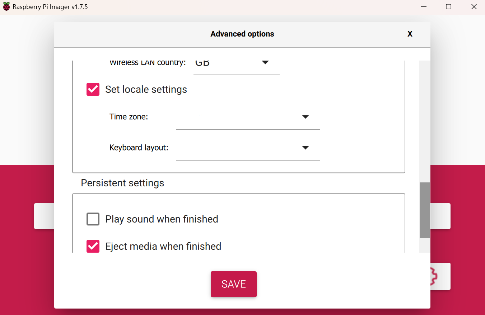

Set hotsname as Pi , enable SSH and select use password authentication.
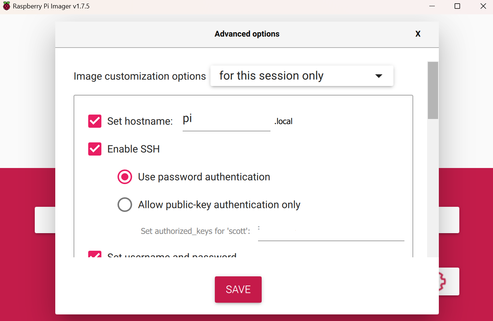

Save and write SD, takes a few minutes.
Insert SD and turn on Pi, navigate to router on local network (192.168.1.1 for me) and login to router, navigate to connected devices and find Pi address.

# Enable External Storage via GUI
Access nextcloud at 192.169.1.x/nextcloud fill out form adding user and usng
database user and password set in terminal prompts with  database name nextclouddb.
Browser will return error message once set up, vistit 192.169.1.x/nextcloud and:

Click top right userprofile icon and select Apps.
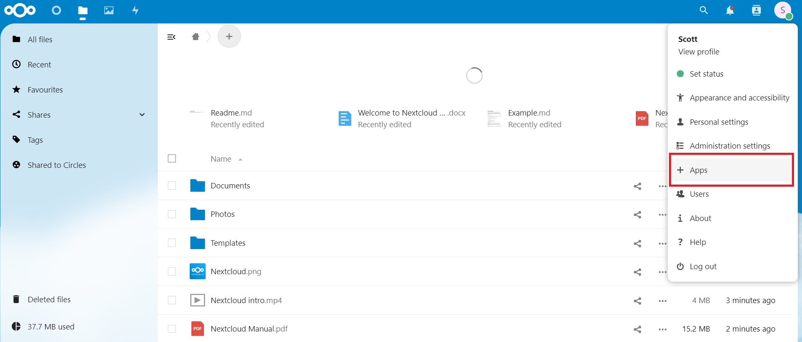

Scroll list and select Enable on External Storage support
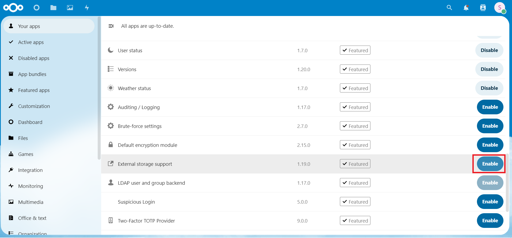

Wait several seconds, again select user icon at top right and select Administrator settings.
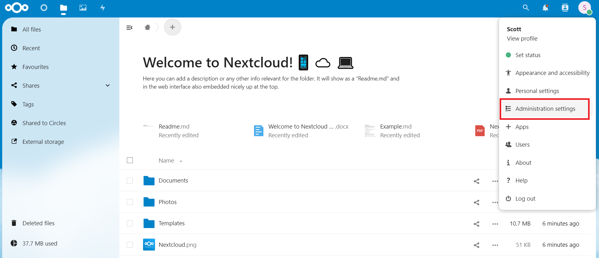

Select External storage tab on left and add name, Local, and add mount point defined in mount-drives.sh - /media/hardrive1
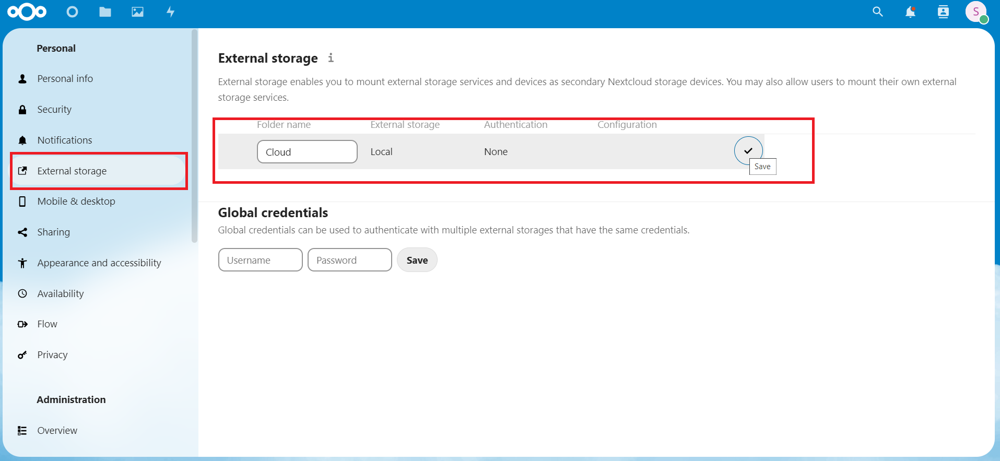

Relay wiring:

_note_ GPIOs 0-8, 14 & 15 appearhigh at boot, if connected to these pins relay will power up, connect 2nd HD then power down so don't use these pins.
__Relay__  __Pin__
__+__  =    __5v Power__ (board no# 2)
__-__  =     __Ground__   (board no# 14)
__s__  =    __GPIO 14__  (board no# 8)

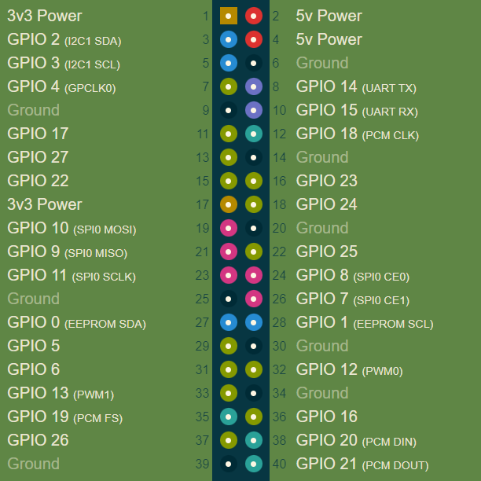

## Add Powerdown Button
Pi dosen't ship with power off button, shutting down cleanly avoids SD card corruption so add a switch and python script to enable clean shutdowns before turing off at plug.

Use board pins __39__ (ground) and __40__ (GPIO21):
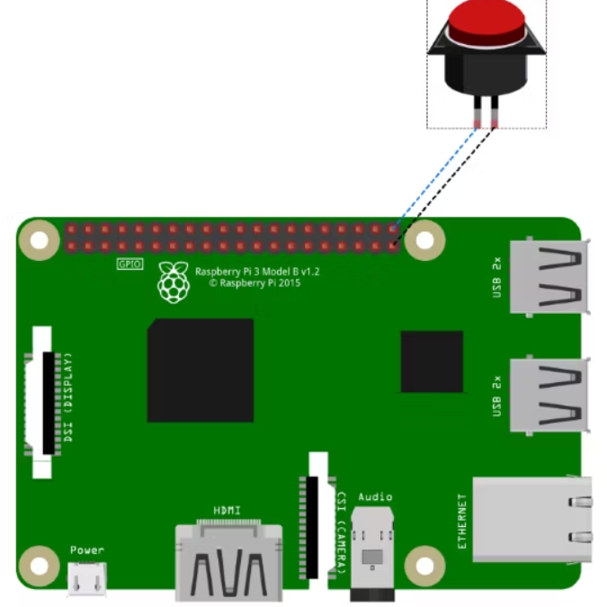

## External Access
Resources:
https://help.nextcloud.com/t/how-to-access-from-outside-your-network/126311
https://techmadeeasy.co.uk/2020/03/access-a-nextcloud-server-from-outside-your-home-network/
Nextcloud desktop client:
https://nextcloud.com/install/#install-clients

Set up account and domain name with following DDNS service:
https://www.noip.com/

Open SSH to Pi andchange dir to
``cd /var/www/html/nextcloud/config``

Open config file
``sudo nanoconfig.php``

add domain name to
``'trusted_domains' =>
   array (
     0 => '192.168.1.100',
     1 => 'your.ddns.domain',
   ), ``

Set up port fowarding rules on router

# Create Backup Image of Pi SD
Download & install imaging software:
https://sourceforge.net/projects/win32diskimager/

- Insert SD card from Pi & Open Win32 Disk Imager, check drive letter and select under device dropdown:
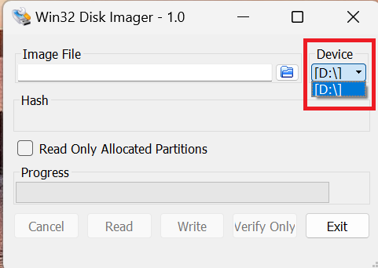

- Select folder icon to select save location for image:

- In pop up navigate to desired save location and enter  desired image name, ensure file extenino is .img
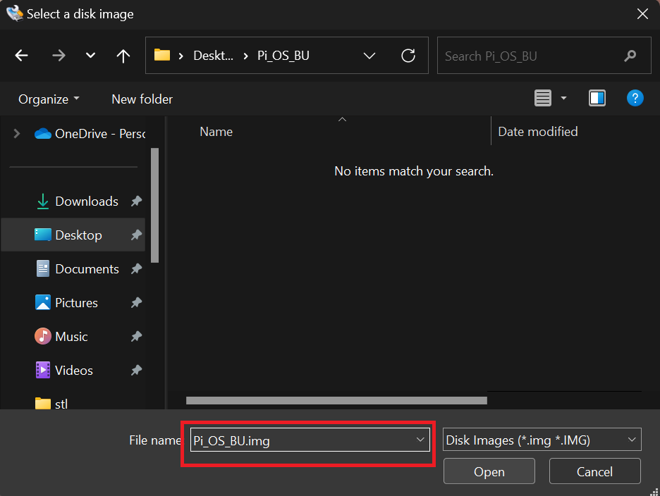

Select read option to save, operation can take 10 -20 mins.
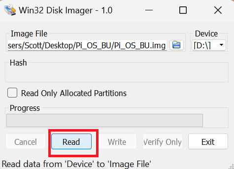
