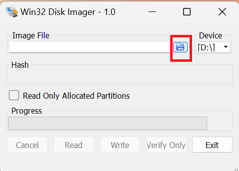

TODO:
- script to automate gui config on NC
- script to automate gui config on Plex.
# Pre steps
- Rename main external hard drive to cloudDrive and back up to cloudDriveBU.
- _note_ Synch drives before setting up as MUCH quciker if large and popultated (use Free file sync).

- Ensure Hd cloudDrive is attatched to permenant usb and cloudDriveBU attatched to realy controled USB.

## Initial Pi 4 Setup
Download SD card formating software:
https://www.sdcard.org/downloads/formatter/

Format card on local machine:

Download Raspberry Pi Imager:
https://www.raspberrypi.com/software/

Run Raspberry Pi Imager and flash OS,
version:

``PRETTY_NAME="Debian GNU/Linux 12 (bookworm)"``
``NAME="Debian GNU/Linux"``
``VERSION_ID="12"``
``VERSION="12 (bookworm)"``
``VERSION_CODENAME=bookworm``
``ID=debian``
``HOME_URL="https://www.debian.org/"``
``SUPPORT_URL="https://www.debian.org/support"``
``BUG_REPORT_URL="https://bugs.debian.org/"``

Select settings (cog wheel - lower right)

Select 'Enable shh'
Select 'Use password authentication'
'set authorised keys' auto fills to local user.
enter username and password. __DO NOT USE DEFAULT USERNAME & PASSWORDS__.

Select 'Configure wireless LAN option and enter network details.

Local settings auto filled, if not complete.

Set hotsname as Pi , enable SSH and select use password authentication.

Save and write SD, takes a few minutes.
Insert SD and turn on Pi, navigate to router on local network (192.168.1.1 for me) and login to router, navigate to connected devices and find Pi address.

# Update Pi
- On network connected computer open Powershell and run the following command, if this is the first time connecting you will be prompted for ssh fingerprint, type yes.

    ``ssh <username>@192.168.1.x -v``

__Note:__ if this has been done before and is fresh installation, navigate to C://users/user/.ssh/known_hosts and delete previous fingerprint.

 - Clone this repo:
``git clone https://github.com/scottolivermorgan/NAS_drive.git``

__Note:__ if the following error occurs:
``error: RPC failed; curl 16 Error in the HTTP2 framing layer``

retry cmd, else if error persits Run:
    ``git config --global http.version HTTP/1.1``
    and re- try the clone cmd

- Update packages and reboot Pi:
``yes | sudo sh NAS_drive/scripts/update.sh``

The Pi reboots upon completion.

# New Version 03092023
- On network connected computer open Powershell & reconnect to Pi:
``ssh <username>@192.168.1.x -v``

- Run nextcloud script and follow prompts, pi user is your current user, then set nextcloud user name & passweord as prompted.
``sudo sh NAS_drive/scripts/nc.sh``

- Schedule relay for back up every 24 hours (_note_ runs in superuser cron jobs -no crontab for root-ignore):
``sudo sh NAS_drive/scripts/backup_drive/schedule-backup.sh``

- Edit start up scripts to run shutdown.py to listen to button
``sudo sh NAS_drive/scripts/shutdown_switch/shutdown.sh``

# Enable External Storage via GUI

Click top right userprofile icon and select Apps.

Scroll list and select Enable on External Storage support

Wait several seconds, again select user icon at top right and select Administrator settings.

Select External storage tab on left and add name, Local, and add mount point defined in mount-drives.sh - /media/hardrive1

Return to SSH shell and reboot Pi.
``sudo reboot``

## Plex
Install plex
``sudo sh NAS_drive/scripts/plex/plex-installation.sh``

Move metadata locatoin to external HD - requires super user perms
``sudo su``

``sh NAS_drive/scripts/plex/mv_meta_loc.sh``

Access Plex at 192.168.1.x:32400/web -x dependant on your local network.

Sign in/create account and addexternal lib via GUI
Add Libary > harddrive1 (in this case as has been set in previouse steps)

## Backup drive
- Schedule relay (_note_ runs in superuser cron jobs):
``sudo sh NAS_drive/scripts/backup_drive/schedule-backup.sh``

Relay wiring:

_note_ GPIOs 0-8, 14 & 15 appearhigh at boot, if connected to these pins relay will power up, connect 2nd HD then power down so don't use these pins.
__Relay__  __Pin__
__+__  =    __5v Power__ (board no# 2)
__-__  =     __Ground__   (board no# 14)
__s__  =    __GPIO 14__  (board no# 8)

## Add Powerdown Button
Pi dosen't ship with power off button, shutting down cleanly avoids SD card corruption so add a switch and python script to enable clean shutdowns before turing off at plug.

 - Edit start up scripts to run shutdown.py to listen to button
``sudo sh NAS_drive/scripts/shutdown_switch/shutdown.sh``

- Reboot Pi
``sudo reboot``

Use board pins __39__ (ground) and __40__ (GPIO21):

## Harden Security
- Install packages to auto update security patchs
``yes | sudo sh NAS_drive/scripts/harden_security/auto_patch.sh``

__Note:__ SSH port changed from 22 to 1111

## External Access
Resources:
https://help.nextcloud.com/t/how-to-access-from-outside-your-network/126311
https://techmadeeasy.co.uk/2020/03/access-a-nextcloud-server-from-outside-your-home-network/
Nextcloud desktop client:
https://nextcloud.com/install/#install-clients

Set up account and domain name with following DDNS service:
https://www.noip.com/

Open SSH to Pi andchange dir to
``cd /var/www/html/nextcloud/config``

Open config file
``sudo nanoconfig.php``

add domain name to
``'trusted_domains' =>
   array (
     0 => '192.168.1.100',
     1 => 'your.ddns.domain',
   ), ``

Set up port fowarding rules on router

# Resolve Nextcloud security prompts
- The PHP memory limit is below the recommended value of 512MB
``sudo nano /etc/php/8.1/apach2/php.ini``
change line:

``memory_limit = 128M``
to
``memory_limit = 1G``

# Create Backup Image of Pi SD
Download & install imaging software:
https://sourceforge.net/projects/win32diskimager/

- Insert SD card from Pi & Open Win32 Disk Imager, check drive letter and select under device dropdown:

- Select folder icon to select save location for image:

- In pop up navigate to desired save location and enter  desired image name, ensure file extenino is .img

Select read option to save, operation can take 10 -20 mins.
